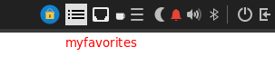
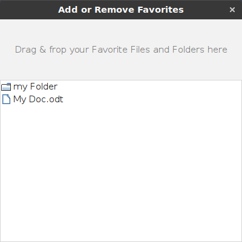
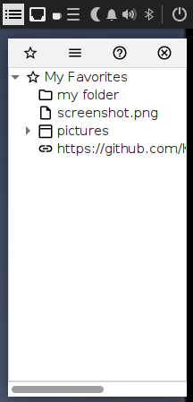

# myfavorites
Access your favorite files and folders easily

Drag & drop your files, folders and web links into myfavorites. They are then presented in a list from where you can access them easliy.
Although myfavorites is a Java 11 application, it's built and tested mainly for Linux.
See Wiki for a brief manual.
When started myfavorites displays a small icon in the system tray from where you can access it.
Spported languages are english, german.

# Issues
* When started automatically the tray icon may not be visible.
This is because the system tray is not yet up to support Java. See error log.
You can start myfavorites with -Ddelay=&lt;your-delay-in-millis&gt;. Try 5000 millis if you get this problem.
* Currently myfavoriites expects the system tray on top of the screen.

System tray

Manage favorites

Display favorites 
Select an item. Double click or hit ENTER to open

