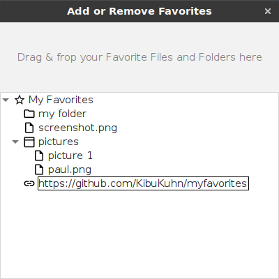

# myfavorites
Access your favorite files and folders easily

Drag & drop your files and folders into myfavorites. They are then presented in a list from where you can access them easliy.
Although myfavorites is a Java 11 application, it's built and tested mainly for Linux.
See src/main/resources/help.html for a brief manual.
When started myfavorites displays a small icon in the system tray from where you can access it.

System tray

Manage favorites

Display favorites

